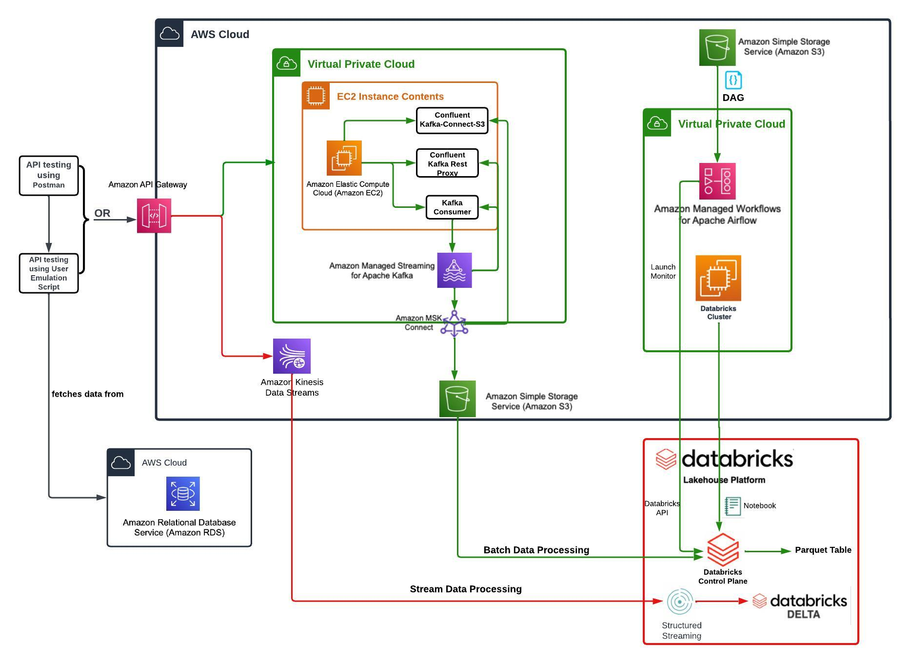

# Project Title: Pinterest Data Pipeline

#    Table of Contents
1. [Background](#background)
2. [AWS Components Used:](#components)
3. [File structure](#file_structure) 
4. [How to Install](#install)
5. [License information](#license) 
6. [What I have learned](#learned) 

##   Background of the project 
This is the third project I completed for my data engineering immersive training, at [AI Core](https://www.theaicore.com/).

Pinterest crunches billions of data points every day to decide how to provide more value to their users.  
This project creates a similar data system using the AWS Cloud.  
This aim is to produce a batch and streaming data processing pipelines.  
There are three topics of data:
- pinterest data: posts Pinterest users posted to Pinterest
- geolocation data: information concerning the geolocation of each Pinterest post
- user data: information concerning the user who uploaded each post

## AWS Components used in the project:
- AWS S3
- AWS EC2
- AWS Kafka
- AWS MSK
- AWS API Gateway
- AWS Managed Apache Airflow
- AWS MWAA
- AWS Kinesis

## Structure of the Project
<pre>
<b>pinterest-data-pipeline/</b>
├─ <b>CloudPinterestPipeline.jpeg/</b>
│  <i>An overview of the data pipeline architecture/</i>
├─ <b>data_emulation</b>
│  ├─ <b>user_posting_emulation.py</b>
│  │  <i>Python scripts for connecting to database and emulate data to Kafka topics using API Invoke URL</i>
│  └─ <b>user_posting_emulation_streaming.py<b>
│     <i>Python scripts for connecting to database and emulate stream data into Kinesis Streams</i>
├─ <b>databricks/</b>
│  ├─ <b>Batch_Data_Processing_and_Queries.ipynb<b>
│  │  <i>Python scripts in notebook for ingesting, cleaning, and making queries batch data from AWS S3</i>
│  └─ <b>Steaming_Data_Processing.ipynb<b>
│     <i>Python scripts in notebook for ingesting and cleaning stream data from AWS Kinesis</i>
├─ <b>0a5e6ec37a2f_dag.py</b>
│  <i>DAG file uploaded to Airflow for running Databricks notebook</i>
└─ <b>README.md</b>
</pre>

##    How to install? 
Clone [this project](https://github.com/verbonbon/multinational-retail-data-centralisation)   

##    License information 
MIT  

##    What I have learned 
For the multiple components of AWS to work together to build a smooth data pipeline, 
it is essential to have a clear naming system for the key topics and associated files. 
It is also a good idea to get familiar with the data in a smaller batch at first,  
to test run the codes and to build script for cleaning the data.  
I also like to thank the amazing AICore support engineers, 
for their help and patience! 
